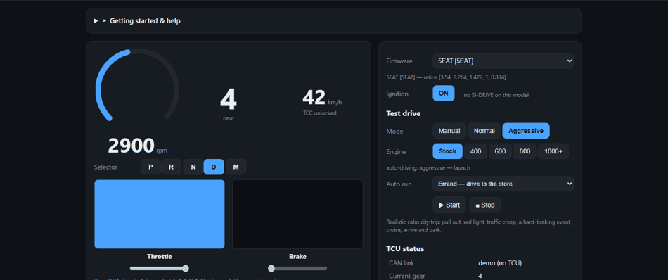
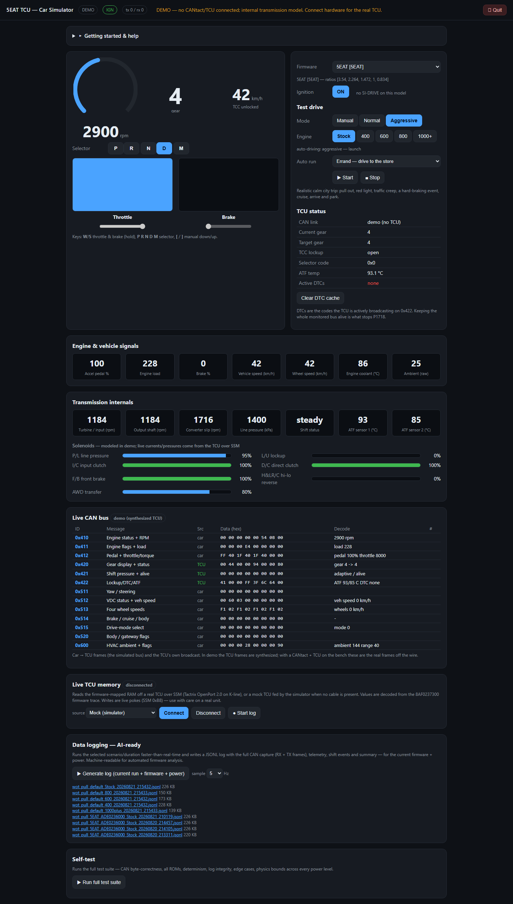

# 5EAT TCU Simulator

A bench tool for developing and testing **Subaru 5EAT transmission control unit (TCU)**
firmware. It runs a physics-based car simulator that exercises the transmission
logic in real time, and provides a live window into a real TCU's internal memory
over SSM — so you can watch and tune behaviour on the bench.

Everything runs with **no hardware** (demo / mock mode), and lights up with real
data when you connect a CANtact Pro and a powered TCU.

<p align="center">
  
</p>

<p align="center">
  
</p>

> **Firmware:** the full 5EAT TCU ROM set (both the Hitachi/M32R and Denso/SH7058
> families) is supplied in [`roms/`](roms/) and bundled with the packaged app, so the
> firmware selector is populated out of the box. These are OEM calibration binaries,
> included here for bench development and research.

---

## Highlights

- **Physics-driven car simulator** — longitudinal vehicle model, torque converter,
  gear ratios and traction limiting, calibrated to real-world 0–60 data; drives the
  TCU logic instead of replaying canned messages.
- **Per-firmware behaviour** — select a TCU ROM and the sim loads that firmware's
  real parameters (e.g. gear ratios extracted from the binary).
- **Power levels & driver models** — stock through 1000+ hp, with calm / normal /
  spirited driver behaviour and scripted test drives (errand, city cycle, WOT
  launch) and 20/40/60/120-minute duration runs.
- **Live TCU memory monitor (SSM)** — reads firmware-mapped RAM off a real TCU over
  K-line (Tactrix OpenPort 2.0), decoded from the firmware trace: range/gear, shaft
  speeds, ATF temps, line pressure, DTC flags, and the control-valve-body **memory
  box** link. Supports live pokes (byte writes).
- **Realistic thermals** — two ATF temperature sensors modelled and coupled to
  engine coolant, rising with power.
- **AI-ready logging** — runs and the live monitor write JSONL logs with full CAN +
  telemetry capture for automated analysis.
- **Standalone app** — one server, two front doors (native app window or browser),
  packaged as a portable folder or a driver-bundling installer. No Python needed to
  run the packaged build.

---

## Quick start

### Option A — Installer (recommended)
1. Download `TCUSimulator-Setup.exe` from the [Releases](../../releases) page.
2. Run it (it needs admin — it installs the hardware drivers) and follow the prompts.
3. Launch **TCU Simulator (App window)** or **(Browser)** from the Start menu.

The installer bundles the FTDI serial driver (Tactrix), Zadig for the CANtact WinUSB
bind, and the Edge WebView2 runtime. See [`drivers/README.md`](drivers/README.md).

### Option B — Portable
Unzip `TCUSimulator_portable.zip` anywhere and run `TCUSimulator.exe`. (Drivers not
included — install them separately if you use hardware; see `drivers/README.md`.)

### Option C — From source
```bash
pip install -r requirements.txt
python app.py            # native app window; use --shell browser for a browser tab
# or: python run.py      # simple browser launcher
```

---

## Using it

- **Drive:** pick a firmware ROM and power level, then use the throttle/brake sliders
  and the P‑R‑N‑D‑M selector, or the keyboard — **W** throttle, **S** brake,
  **P R N D M** range, **[ ]** manual gear.
- **Test drives:** choose a scenario or duration run and press start; shift events and
  a summary are logged.
- **Live TCU memory:** open the *Live TCU memory* panel, choose **Mock (simulator)**
  or **Tactrix OpenPort 2.0 (serial)**, and Connect. Rows update live; the **✎**
  button writes a byte. Toggle **Start log** to record JSONL.
- **Quit:** the **⏻ Quit** button in the header shuts the app (and releases the
  CANtact) cleanly.

### Firmware ROMs (supplied)
The full TCU ROM set ships in [`roms/`](roms/) — 25 firmwares across the Hitachi/M32R
and Denso/SH7058 families — so the selector is populated with no setup. Gear ratios
are extracted from the Hitachi family; other firmwares are still selectable and fall
back to model defaults for parameters not yet mapped. To use a different set, point
`TCUSIM_ROM_DIR` at your own folder of `.bin` files (it overrides the bundled set).

---

## Hardware

| Device | Use | Interface |
|--------|-----|-----------|
| **CANtact Pro** | drive the CAN bus, read TCU broadcasts | gs_usb / WinUSB (native Windows) |
| **Tactrix OpenPort 2.0** | SSM live memory read/write on K-line | FTDI serial COM |

Driver install and setup: [`drivers/README.md`](drivers/README.md). On a normal
Windows 10/11 machine, Windows often auto-installs the FTDI driver; the CANtact needs
its WinUSB driver bound with Zadig (the installer walks you through it).

> ⚠️ **Safety:** the live monitor can write to TCU RAM (SSM pokes). Do this on a
> **bench** unit, never in a vehicle you intend to drive, and know what an address
> does before writing it. You are responsible for what you flash/poke.

---

## Live memory monitor & firmware map

The monitor polls a curated watch-list of RAM addresses (`tcu_sim/tcu_map.py`) with
one SSM `0xA8` batch read per cycle and decodes each value from the firmware trace —
including the memory-box serial link on the control valve body (state, signature,
comm-fault / P1601). Addresses and roles are firmware-derived; a few analog
engineering scales are marked `raw` until cross-checked against a live unit. Reads
use SSM `0xA8`/`0xA0`, writes use `0xB8` (`tcu_sim/ssm.py`).

---

## Building & packaging

```powershell
powershell -ExecutionPolicy Bypass -File fetch_drivers.ps1   # stage signed drivers
powershell -ExecutionPolicy Bypass -File build.ps1           # exe + portable zip + installer
```
`build.ps1` produces `dist\TCUSimulator\` (one-folder app), `dist\TCUSimulator_portable.zip`,
and — if Inno Setup is installed — `dist\TCUSimulator-Setup.exe`. Packaging uses
PyInstaller (`TCUSimulator.spec`) and Inno Setup (`installer.iss`).

## Tests
```bash
python test_suite.py     # simulator/physics/log integrity (runs without firmware)
python test_live.py      # SSM codec + live monitor against the mock TCU
```

## Project layout
```
app.py                standalone launcher (window/browser, clean quit)
run.py                simple browser launcher
tcu_sim/
  server.py           FastAPI server (dashboard + REST + websocket)
  simulator.py        real-time orchestration
  vehicle.py          vehicle/transmission physics + ATF thermal model
  driver.py           driver behaviour models
  romdata.py          per-ROM firmware parameter extraction
  can_gateway.py      CANtact Pro I/O (python-can / gs_usb)
  ssm.py              SSM2 protocol codec
  ssm_transport.py    transports: mock, Tactrix serial, J2534 (stub)
  live.py             live memory monitor (poll/poke/log)
  tcu_map.py          firmware RAM watch-list + decoders
  messages.py         CAN message codecs
  web/index.html      dashboard UI
```

## Troubleshooting
- **"DEMO — no CANtact/TCU"** — no CAN hardware found; the internal model runs so the
  UI is still usable. Connect the CANtact and check its WinUSB driver (Zadig).
- **No COM port for the Tactrix** — install the FTDI driver; confirm the port in the
  Live panel's port dropdown.
- **No ROMs in the selector** — set `TCUSIM_ROM_DIR` or add a `roms/` folder.
- **SmartScreen warns on the installer** — the build is unsigned; sign it to remove
  the warning.

## License
MIT — see [LICENSE](LICENSE).

## Credits
Built on [python-can](https://github.com/hardbyte/python-can), FastAPI/uvicorn, and
pyserial. Bundled drivers are by their respective vendors (FTDI, Microsoft, and the
Zadig/libwdi project) and are installed under their own licenses.
