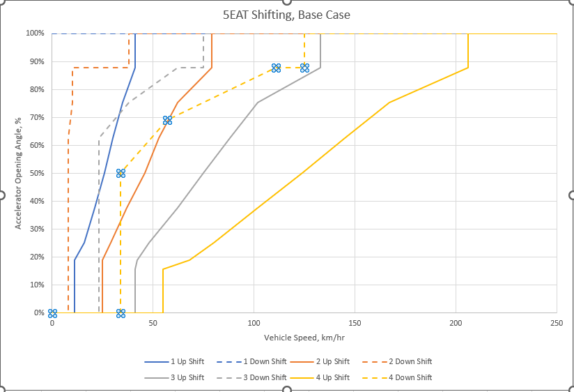

# Subaru 5EAT TCU — Reverse Engineering Notes & RomRaider Definition

Reverse engineering of a Subaru 5EAT (5-speed automatic) transmission control unit
ROM, and a working RomRaider definition file that lets you open and edit the
calibration tables in it.

**Eleven firmwares included**, all Mitsubishi/Renesas M32R, all with verified
checksums. Full decompiler output is provided for every one of them.

| Cal ID | ROM ID | Size | Vehicle / notes | Tables mapped |
|---|---|---|---|---|
| `MB431M` | `91D1206000` | 384K | JDM | **yes** |
| `MB436G` | `91FE216300` | 512K | USDM, Early 2005 Outback XT | **yes** |
| `MB436T` | `91D0207500` | 384K | JDM | not yet |
| `MB436P` | `91F0217100` | 384K | USDM Outback 03 | not yet |
| `MB4434` | `ABD1A03100` | 384K | JDM Legacy GT 2005 | not yet |
| `MB4373` | `91D1207900` | 384K | Hitachi 31711AG589 | not yet |
| `MB440X` | `AAD1A07100` | 384K | Hitachi 31711AJ782 | not yet |
| `MB5300` | `ABD1207000` | 384K | 06 JDM Legacy GT | not yet |
| `MB558D20` | `ACD1A06000` | 512K | JDM 2007 | not yet |
| `MB558D01` | `ACD1207000` | 512K | LGT06 JDM | not yet |
| `MB562EH1` | `ADE0236000` | 512K | — | not yet |

The definition file carries every mapped firmware. **RomRaider selects the right
one automatically** by matching the cal ID at `0x8008` when you open a ROM —
there is nothing to choose.

This is an ongoing project. Table addresses, the DTC list, the checksum algorithm,
and three real-world unit conversions are confirmed. Plenty is still unidentified,
and that's marked honestly throughout rather than guessed at.

---

## What's here

| Path | What it is |
|---|---|
| [`definitions/`](definitions/) | The RomRaider definition file — both firmwares, auto-selected by cal ID. Start here. |
| [`docs/ROMRAIDER-SETUP.md`](docs/ROMRAIDER-SETUP.md) | How to actually get this working in your RomRaider install. |
| [`docs/ROM-DETAILS.md`](docs/ROM-DETAILS.md) | Everything known about this specific binary — provenance, IDs, memory map. |
| [`docs/TECHNICAL-NOTES.md`](docs/TECHNICAL-NOTES.md) | How the tables, checksum, and unit scales were worked out. |
| [`tools/`](tools/) | Python tools (checksum fix, definition generator, validators) and Ghidra scripts. |
| [`decompiled/`](decompiled/) | Full decompiler output for both ROMs, ~46,500 lines each. |
| [`rom/`](rom/) | The ROM images themselves. |

---

## Quick start

1. Install [RomRaider](https://www.romraider.com/) (tested against 1.0.0).
2. Point it at `definitions/5eat_tcu_romraider_defs.xml`.
3. Open either ROM from `rom/`.
4. **After any edit, fix the checksum before flashing** — RomRaider cannot do it for
   this ROM:
   ```bash
   python tools/checksum.py --fix edited.bin
   ```

Full instructions, including the settings RomRaider needs and how to enable debug
logging if tables don't appear, are in [`docs/ROMRAIDER-SETUP.md`](docs/ROMRAIDER-SETUP.md).

---

## What's confirmed

Three real-world unit conversions are nailed down, each verified two independent
ways (against the factory service manual *and* against the firmware's own arithmetic):

- **Gear ratios** — `raw / 1024`. Decodes to 3.540 / 2.264 / 1.471 / 1.000 / 0.834,
  matching the published ratios to within 0.0007.
- **Engine speed** — `raw / 8`. Gives clean 640 RPM breakpoints topping out at 6400 RPM.
- **Temperature** — `raw − 40` °C. Two NTC thermistor channels, standard −40…+215 °C
  automotive encoding.
- **Vehicle speed** — km/h directly, no scaling.
- **Accelerator angle** — raw 0–255 mapping to 0–100%.

Also confirmed: the **checksum algorithm** (32-bit big-endian two's-complement
additive, stored twice at `0x8000`/`0x8004` — over two different region
conventions, which the tool detects rather than assumes), the **DTC table** at
`0x4090` (19 real P07xx transmission codes), and the **shift schedule**, which is
fully decoded.

### The shift schedule

The eight shift-point curves are editable, in real units. Each is a polyline in
**vehicle speed (km/h)** against **accelerator opening angle (%)** — the same form
as the factory shift chart, which is what the encoding was verified against:



Slot A is the upshift from a given gear and slot B the downshift, which is why 1st
gear has no downshift curve and 5th has no upshift — both are placeholders in the
ROM, exactly where that reading predicts.

## What's not

IDK

---

## Credits

**Almost none of the raw material here is mine.** This project is analysis layered
on top of other people's work, and the pieces below belong to them.

### The ROM images

Every firmware in [`rom/`](rom/) was dumped and shared by members of the RomRaider
forum thread [**5EAT TCM JECS ROM Image**](https://www.romraider.com/forum/viewtopic.php?f=40&t=13725)
— a years-long community effort. Getting these off a car is slow, fiddly, and
occasionally risks the TCU. They are included here so the work can continue, not
because I have any claim to them. If you contributed a dump and want it removed or
credited differently, open an issue and I'll act on it.

The `91FE216300` image (Early 2005 USDM Outback XT) is the one I dumped myself.

### The shift-curve chart

[`docs/shift-curves-reference.png`](docs/shift-curves-reference.png) was produced
and posted to the thread by another member, on page 9, alongside this description:

> *"The shift table pointers start at 0x180e8. The first lot of data is at
> 0x0001683c. The data is structured as words (uint16) in pairs of x, y. x is the
> Vehicle Speed in km/hr. y is the Accelerator Pedal Angle in % where 0xff = 100%.
> The data is terminated by 0xffff."*

**It is not my work**, and it is the single most valuable external input to this
project: the shift-schedule units were verified against it. That post also states
the encoding outright, which independently confirms what was derived here from the
chart geometry — same units, same 0xff = 100% mapping, same terminator.

Both claims in that post were checked against the `ACD1A06000` image and hold
exactly: the pointer array is at `0x180E8`, its first entry points to `0x01683C`,
and the data there parses as (speed, pedal) pairs ending in `0xFFFF`.

**The chart is rimwall's work.**

### The people in that thread

The thread runs to 380 posts over several years. These are the contributors named
in it — the work here rests on theirs:

**[rimwall](https://github.com/rimwall)** — by a wide margin the largest
contributor: the shift-curve chart above, the shift-table encoding, the
security-access and protocol work that made these TCUs readable at all, the Denso
side, and the FastECU OEM fork.

**MiikaS** ([miikasyvanen](https://github.com/miikasyvanen)) — FastECU itself,
without which none of these ROMs could be dumped.

**ajayel**, **riksk**, **jimihimisimi**, **AJ08H65EAT**, **kiki86**,
**curt4576** — the testing effort: dumping TCUs, running experimental builds,
posting logs, and bricking-risk on their own vehicles to prove the read/write
paths.

**Sasha_A80** — the original JDM ROM that opens the thread and the M32R chip
identification. **V6er**, **trcxsa**, **Blake_Volpex**, **ciper**, **SergArb**,
**roadie**, **Waselon**, **dschultz**, **b4andrey**, **Tugsay**,
**Alucard7002**, **alesv**, **lvkeith**, **fenugrec** — analysis, ROM dumps,
corrections and domain knowledge throughout.

**Comer352L** — FreeSSM, and the branch adding 5EAT TCU adjustment support.

If you are on this list and want your name removed, changed, or your contribution
described differently, open an issue.

### Prior and parallel work

- **[FastECU](https://github.com/miikasyvanen/FastECU)** (Miika Syvänen) and
  **[rimwall's OEM fork](https://github.com/rimwall/fastecu-oem)** — the tooling
  that makes reading and writing these TCUs possible at all. Its
  `checksum_tcu_subaru_hitachi_m32r_can` module independently corroborated the
  checksum algorithm.
- **rimwall** — much of the protocol and security-access work in the thread, and
  the Denso-side reverse engineering.
- **[FreeSSM](https://github.com/Comer352L/FreeSSM)** (Comer352L) — diagnostic
  tooling, and the branch adding TCU adjustment support.
- **[ghidra-m32r](https://github.com/ripnet/ghidra-m32r)** (ripnet) — the Ghidra
  processor module without which none of the disassembly here would exist.
- Forum members whose findings are used directly: the CAN ID meanings
  (`0x412` engine torque, `0x514` shift events), the MCU identification, and the
  observation that gear changes are governed by pedal-angle/speed curves — which
  is what pointed at the shift tables in the first place.

### Reference documentation

Gear ratios, line-pressure targets and ATF operating temperatures come from the
Subaru factory service manual (2004 Legacy). That document is Subaru's and is
**not** redistributed here.

### What is actually mine

The tooling in [`tools/`](tools/), the RomRaider definitions in
[`definitions/`](definitions/), and the written analysis in [`docs/`](docs/) —
the table mapping, the unit derivations, the checksum region detection, and the
multi-firmware porting. That, and nothing else in this repository, is what the
MIT licence covers.

---

## Legal

The ROM image is Subaru/Fuji Heavy Industries firmware, included for
interoperability and repair research. It is not my work and I claim no rights to
it. The decompiler output in `decompiled/` is derived from it and carries the same
status.

My own contributions — the tools, the RomRaider definition, and the documentation —
are MIT licensed. See [LICENSE](LICENSE).

**Flashing a modified transmission controller can damage the transmission.** The
tables here are the result of static analysis; almost none of it has been validated
on a running vehicle. Anything marked experimental or expert-only genuinely is.
Use at your own risk.

— TomFLV
